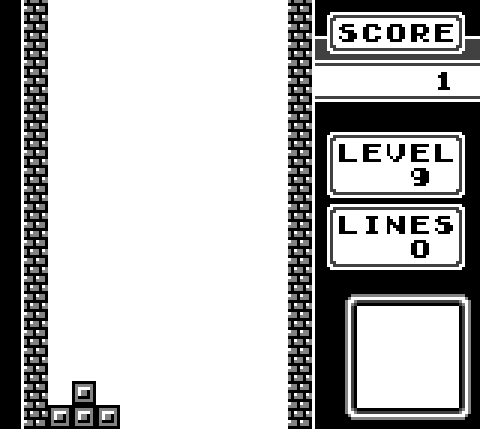

# Emerald Gameboy Emulator


## Description
Yet another attempt at a Gameboy emulator (this time in C++).

## Running Emerald
Run ```make``` to compile the program.

Emerald requires a separate ```./emerald -b <path_to_boot.rom> -c <path_to_game.rom>```

## Debug Console
To enable the debug console, run make with ```FLAGS="DEBUG CLOCK_LIMITER_DISABLE"```.

Emerald can be run using ```./emerald -c <path to rom>``` (you won't be able to do much though)
It is recommended to run Emerald with the default DMG bootloader.
To specify a bootloader other than ```boot.rom```, use the ```-b <path to boot rom>``` flag.
To run a game without the bootloader, use the same path for ```-b``` and ```-c```
(this will only work if RST00 is set to restart the game).

## Checklist
- Implement memory bank controllers for other cartridges
- Implement button inputs
- Implement sound
- Separate graphics into dynamic module
- Rewrite in Rust?
- Simplify clock interface
- Add useful error messages (as opposed to none)
- Add a ```make debug``` target
- Add flag to start emulator with PC at 0x100

## Known Issues
- Barely runs Tetris (gets stuck on demo screen)
- Large number of failed Blaarg tests
- Will not run Kirby's Dreamland


